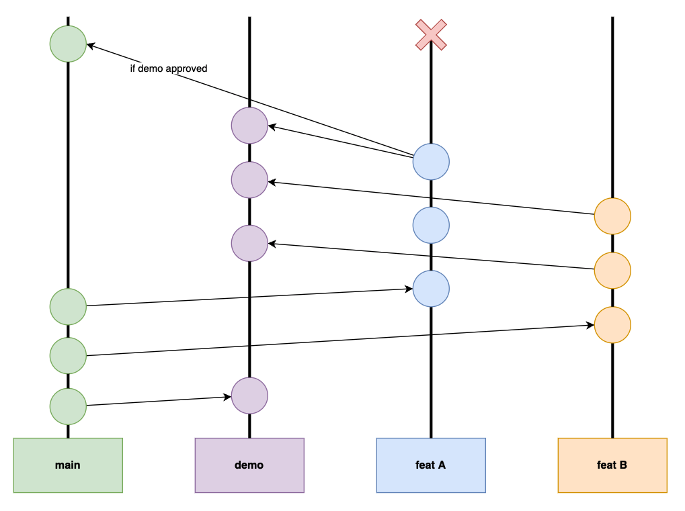

# Contributing

1. Any `feature` branch linked to a Jira or GitHub issue must use this naming : <issue-number>_shortdesc 
2. All changes to the codebase pass through a PR review process
3. No commits are allowed on the `main` branch
4. Each feature must be tested in `demo` before its approbation
5. `demo` branch is not allowed to be force pushed
6. `main` can be merged into `demo` branch when needed
7. To be merged into `main` branch, all PR checks must pass 
8. Only `feature` branches can be merged on `main`
9. `demo` branch can’t be merged on `main`, since it may contain not yet approved features
10. After having merged a `feature` branch into `main`, the branch should be deleted and not pushed later on
11. The `main` branch must always be in a production ready state
12. All changes are written down in the CHANGELOG.md file using this semantic : 2021-11-19.01
13. In case a feature requires changes to be performed after its deployment (eg: in Wordpress), those changes must be described within the PR description
14. Contributions must be simple to review and focused on single goal
15. `demo` branch is deployed on staging1 (climatedata.crim.ca) every 5 minutes
16. `main` branch is deployed manually when needed on cca-portal1.climatedata.ca
17. At least one person from CRIM must have approved the PR before it gets merged to `main`
18. Each PR description must use the predefined PR template, featuring the reason behind this PR, checklists, etc.

<em>Refer to the image below for graphically represented Git workflow.</em>

