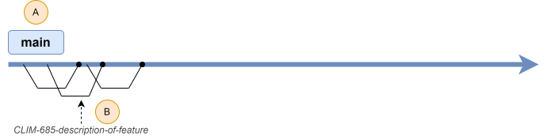
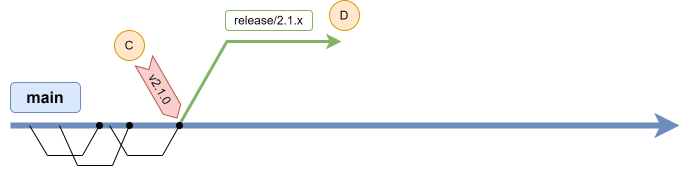
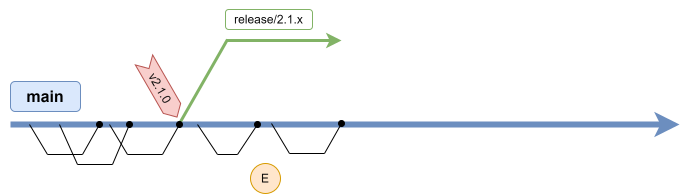
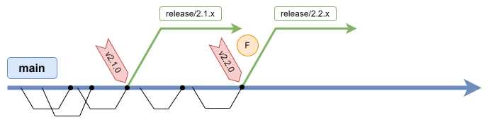
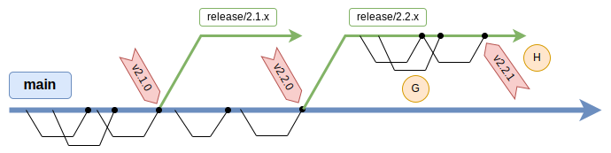

# Git branching strategy

This document describes the Git branching strategy that must be followed for the development.

> The CI/CD pipelines and the automatic deployments are tightly related to this Git strategy, but they are described in
> another document. The current document only describes the Git branching strategy, not the CI/CD process.

## Description

The Git branching strategy described in this document is custom-made, but is greatly inspired by existing strategies,
like [GitHub Flow](https://githubflow.github.io/), [Trunk Based Development](https://trunkbaseddevelopment.com/), or
[OneFlow](https://www.endoflineblog.com/oneflow-a-git-branching-model-and-workflow).

The strategy was created to meet the following objectives:

* Simple.
* Fit our current development process.
* Allow to deploy different versions of the code on different environments.
* Limit the number of branches with active work, to prevent managing too many unsynchronized branches.
* Limit merges between branches to prevent a "merge hell".
* Have a clear "hot fix" strategy.
* Allow release versions, and an easy way to "rollback".

## Developing new features

Development of new features is done on the `main` branch. See (A) in the graph below.

This branch always contain the most up-to-date version of the code. While this branch is not directly used in production
(see the CI/CD process for more details), it must *always contain a working version of the site*, with the latest fixes
and developed features.

When developing a new feature, a _feature branch_ is created from `main`. A _feature branch_ is generally named
`<TICKET>-<DESCRIPTION>` where `<TICKET>` is a related ticket number (ex: a Jira or Basecamp ticket) and `<DESCRIPTION>`
is a short description of the feature. See (B) in the graph below for an example.

The _feature branches_ must be short-lived (no more than a few days) and must be limited in the size of the feature they
introduce. Large features should be split into smaller features. We want to prevent having long-lasting branches that
become difficult to merge.

Merging a _feature branch_ into `main` must pass through the Pull Request process. Always use "Squash and Merge" when
merging.

## Creating a release

A "release" is a version of the code that is considered ready for production. In this Git strategy, a new release is
always for a version containing _new features_. For a version containing only bug fixes, see the "Hot fixes" section
below.

When a release is ready to be made, two steps must be taken:

1. **On the commit on `main` that you want to release, add a _release tag_.**
   
   A _release tag_ serves to mark a commit containing a released version. A _release tag_'s name is the release's
   version number `<MAJOR>.<MINOR>.<PATCH>` preceded by `v`. Example: `v2.1.0`. See (C) in the graph below. 
2. **From the same commit, create a new _release branch_.**

   A _release branch_ allows to eventually implement hot fixes in case a bug is discovered in this release (see
   the ["Hot fixes" section](#hot-fixes) below). The _release branch_'s name is `release/<MAJOR>.<MINOR>.x`. Note that
   `<PATCH>` is replaced by `x`. Example: `release/2.1.x`. See (D) in the graph below. 

It's possible to create a release from a previous commit if we don't want the latest features of `main` to be
released yet. See (E) in the graph below.

Development of new features continue on the `main` branch after the released commit.

When another release from the `main` branch is ready to be created, a new _release tag_ and _release branch_ are
created on the commit to release. See (F) in the graph below for an example for version 2.2.0.

### Release version number

The version number for the release is determined by the developer, based on the previous release's version number. It is
globally inspired by the [semver](https://semver.org/) format `<MAJOR>.<MINOR>.<PATCH>`.

* The `<PATCH>` is increased when introducing fixes that don’t introduce or change existing features. In this Git
  strategy, this number is increased only for [hot fixes](#hot-fixes). A new release should always introduce new
  features, so it should have a `<PATCH>` number of 0.
* The `<MINOR>` is increased when introducing a new feature, or changing an existing feature.
* The `<MAJOR>` is increased when introducing a major redesign that affects most of the site.

### Notes about _release branches_:

* No commits should be allowed on a _release branch_, except for "hot fixes" (see the
  ["Hot fixes" section](#hot-fixes) below). In particular, no new feature should be developed on a _release branch_.
* If a _release branch_ never gets any "hot fix", it will simply stay an "empty" branch starting from a commit on
  `main`.
* The name of the _release branch_ always ends with `.x`, it doesn't include the `<PATCH>` number.
* "Previous" _release branches_ and _release tags_ are not deleted when releasing a new version. They allow for easy
  rollback.

## Hot fixes

A "hot fix" is a correction of a bug on a released version. This section assumes the following about the fix:

* It's a small (bug) fix, not a new feature. New features should be developed only on the `main` branch.
* It's to be applied on a previous release. If it's a fix to apply only on the latest commit of `main`, develop it like
  a _feature_ (see ["Developing new features"](#developing-new-features) above).

Developing a hot fix is similar to developing a new feature and creating a release, except it's done from the _release
branch_ instead of from `main`.

From the _release branch_ of the version to fix, create a new branch and develop your fix in it. Once ready, create a
Pull Request to merge it back into the _release branch_. It's possible to create multiple branches if multiple fixes
are required. See (G) in the graph below.

Once all fixes are approved and merged, create a new _version tag_ on the branch's latest commit. The version number
should only have it's `<PATCH>` version number incremented by one. See (H) in the graph below.

### Apply the fix to _main_

Don't forget to also fix `main` (if applicable) so there is no regression in the next release.

If the fix can be applied exactly the same way, you can merge the _release branch_ into `main`. Alternatively, you can
_cherry-pick_ the commits.

If `main` evolved in a way that the fix cannot be applied the same way, develop the fix like a _feature_ (see
["Developing new features"](#developing-new-features) above).
